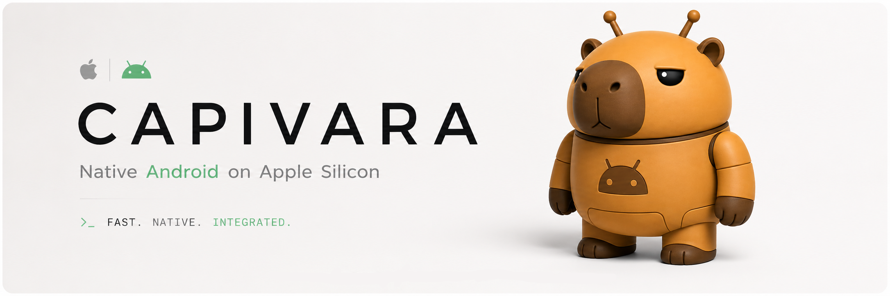

Capivara faz apps Android se comportarem como apps nativos do macOS. Um APK instalado vira um `.app` de primeira classe, com Dock, Spotlight, `Cmd+Tab` e a experiência nativa do sistema.

Android rodando nativamente em Apple Silicon macOS via HVF, `libkrun` e `gfxstream`.

## Roadmap

- fechar o bloqueio atual do `gfxstream` no host
- consolidar o fluxo de imagem, kernel e rootfs em scripts únicos
- tornar o APK instalável e executável como `.app`
- manter o caminho de reprodução curto, pinado e sem passos manuais

## Como Rodar

Veja `docs/STATUS.md` para o estado atual e `docs/REPRO.md` para a reprodução.
